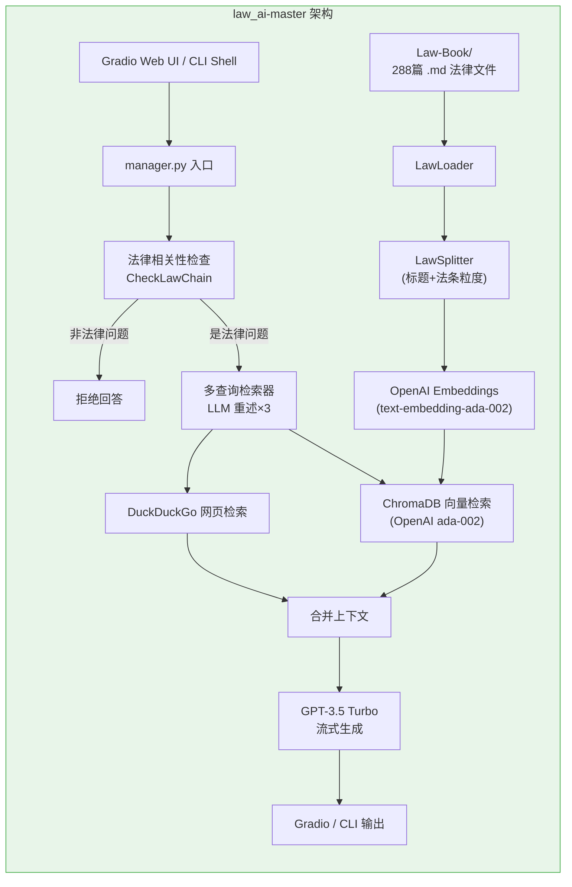
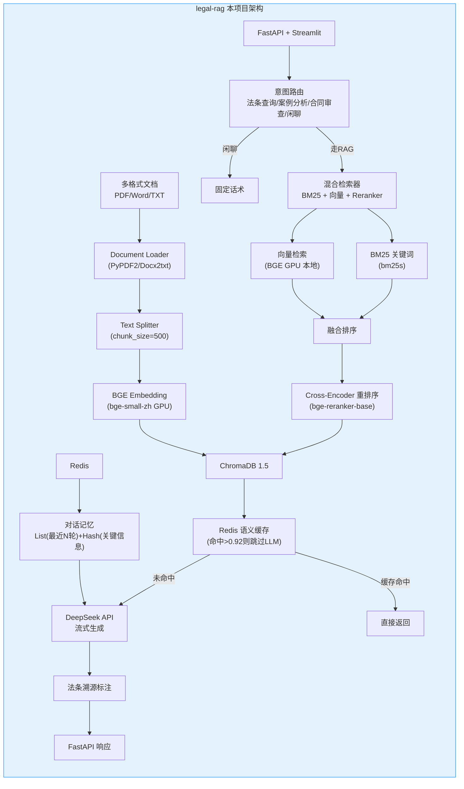
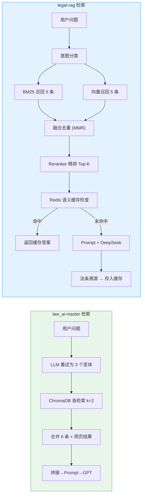
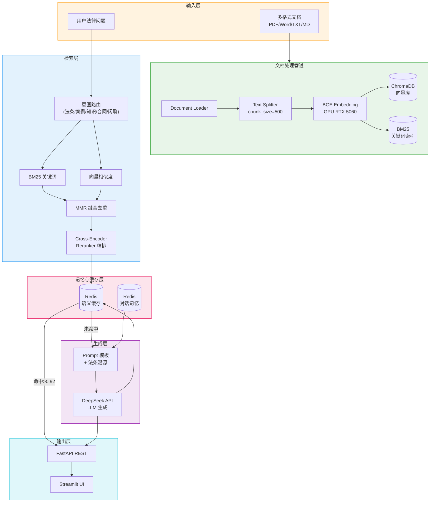

# 法律 RAG 项目架构对比

> law_ai-master（已有项目） vs legal-rag（本项目）

---

## 一、整体架构对比

---

## 二、核心差异对照表

| 维度 | law_ai-master | legal-rag（本项目） |
|------|--------------|---------------------|
| **定位** | 法律 AI 助手（Demo 级） | 法律 RAG 系统（工程级） |
| **LLM** | GPT-3.5 Turbo (OpenAI) | DeepSeek Chat (API) |
| **嵌入模型** | text-embedding-ada-002 (云端) | bge-small-zh (本地 GPU) |
| **重排序** | 无 | Cross-Encoder bge-reranker-base |
| **检索策略** | 多查询重述 + 网页搜索 | BM25 + 向量 + MMR + Reranker |
| **向量库** | ChromaDB 0.4 | ChromaDB 1.5 |
| **缓存** | 无 | Redis 语义缓存 (相似度>0.92) |
| **对话记忆** | 无 | Redis List + Hash 多轮记忆 |
| **意图路由** | 法律/非法律 二分类 | 5 类意图（法条/案例/知识/合同/闲聊） |
| **法条溯源** | 无 | 强制标注法条出处 |
| **时效性** | 无 | 法条时效性标记+TTL 区分 |
| **Web 框架** | Gradio (直接暴露) | FastAPI (RESTful) + Streamlit |
| **文档格式** | 仅 Markdown | PDF / Word / TXT |
| **分段策略** | 标题 + 法条正则 | 递归分割 (chunk_size=500) |
| **外部搜索** | DuckDuckGo | 无（依赖知识库完整性） |
| **LangChain** | 0.1.1 | 1.3.x |
| **GPU 利用** | 无（全云端） | RTX 5060 本地推理嵌入+重排序 |
| **数据库** | 无 | 计划 MySQL（日志）+ Redis |

---

## 三、检索流程深度对比

---

## 四、数据流对比

```mermaid
flowchart TD
    subgraph DataA["law_ai-master 数据流"]
        DA1["Law-Book/ 288 篇 .md"] --> DA2["LawLoader<br/>(DirectoryLoader)"]
        DA2 --> DA3["LawSplitter<br/>按 ## 标题 / 第X条"]
        DA3 --> DA4["OpenAI Embeddings<br/>(云端 API)"]
        DA4 --> DA5["ChromaDB<br/>(chroma_db/)"]
    end

    subgraph DataB["legal-rag 数据流"]
        DB1["data/docs/<br/>PDF/Word/TXT"] --> DB2["DocumentLoader<br/>(PyPDF2/Docx2txt/TextLoader)"]
        DB2 --> DB3["RecursiveCharacterTextSplitter<br/>(chunk_size=500, overlap=50)"]
        DB3 --> DB4["BGE Embedding<br/>(bge-small-zh, GPU)"]
        DB4 --> DB5["ChromaDB<br/>(data/chroma/)"]
        DB5 --> DB6["Redis 语义缓存"]
    end

    style DataA fill:#e8f5e9,stroke:#4caf50
    style DataB fill:#e3f2fd,stroke:#2196f3
```

---

## 五、可复用分析

law_ai-master 中可直接借鉴的部分：

| 可复用 | 说明 | 优先级 |
|--------|------|--------|
| Law-Book/ 288篇法律 | 直接作为本项目的知识库底库 | 高 |
| LawSplitter 正则 | `第\S*条` 正则分法条，比纯 RecursiveSplit 更适合法律文本 | 高 |
| 多查询重述 | LLM 改写 3 个变体增加召回，可补到混合检索 | 中 |
| 法律相关性检查链 | 先判断是否法律问题再走 RAG，减轻意图路由压力 | 中 |
| CheckLawChain | 布尔分类器，可复用为意图路由的一个分支 | 中 |
| DuckDuckGo 网页补充 | 当知识库覆盖不足时实时搜索补充 | 低 |

law_ai-master 不适合复用的部分：

| 不可复用 | 原因 |
|----------|------|
| OpenAI 嵌入/LLM | DeepSeek 替代，成本更低 |
| Gradio 直接暴露 | FastAPI 更适合做 RESTful 服务 |
| 无对话记忆 | 本项目有 Redis 多轮记忆 |
| 无缓存 | 本项目有语义缓存 |
| LangChain 0.1 旧 API | 本项目已用 1.3 |
| 无重排序 | 本项目加了 Reranker |

---

## 六、最终推荐架构（本项目）

---

## 七、下一步行动建议

1. **立即**：把 law_ai-master 的 `Law-Book/` 288 篇法律用 `scripts/ingest.py` 入库
2. **优先**：借鉴 `LawSplitter` 的正则逻辑，增强 `document_loader.py` 的法条粒度分段
3. **第三阶段**：按 `文档/2.md` 结尾的预告，实现混合检索 + Reranker + `/chat` 接口
4. **可选**：引入 law_ai-master 的"多查询重述"作为召回补充
